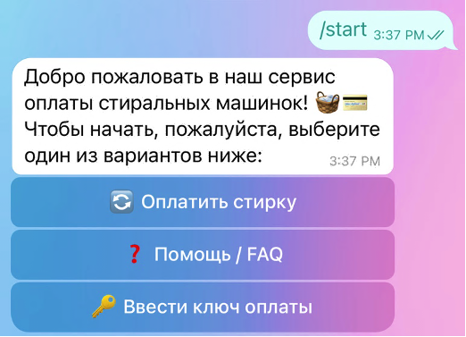
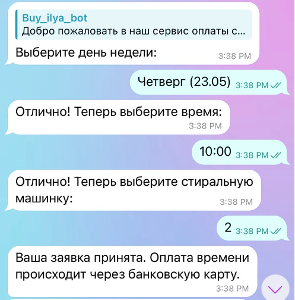
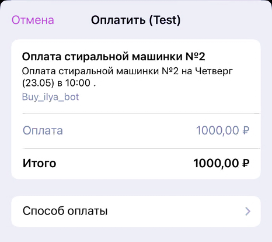
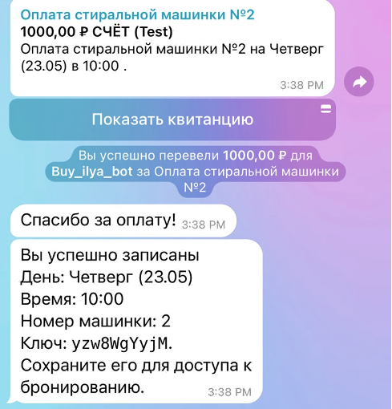
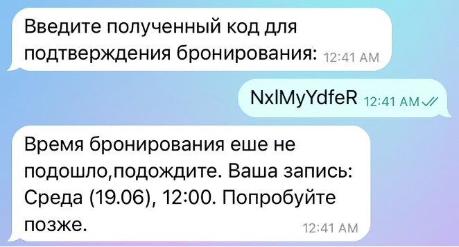
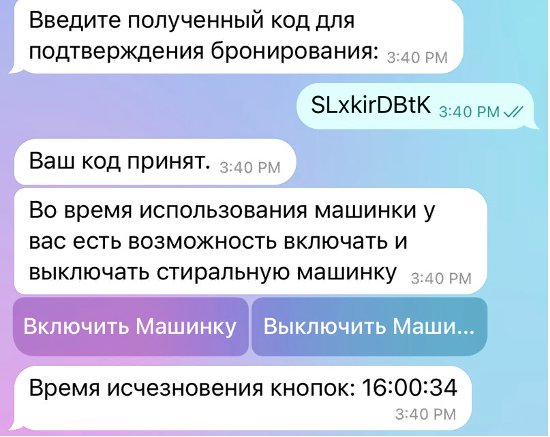
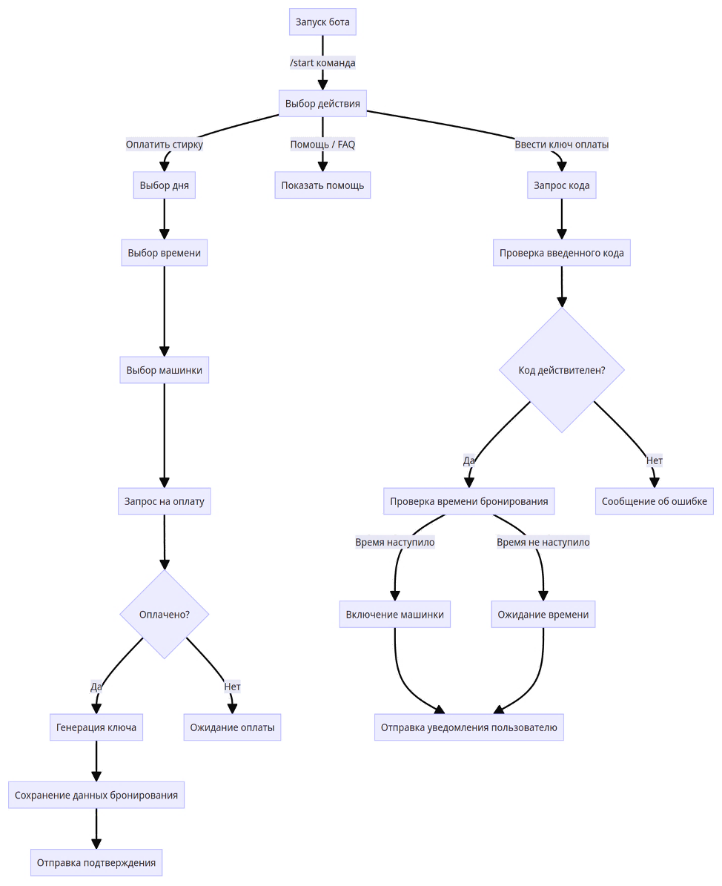
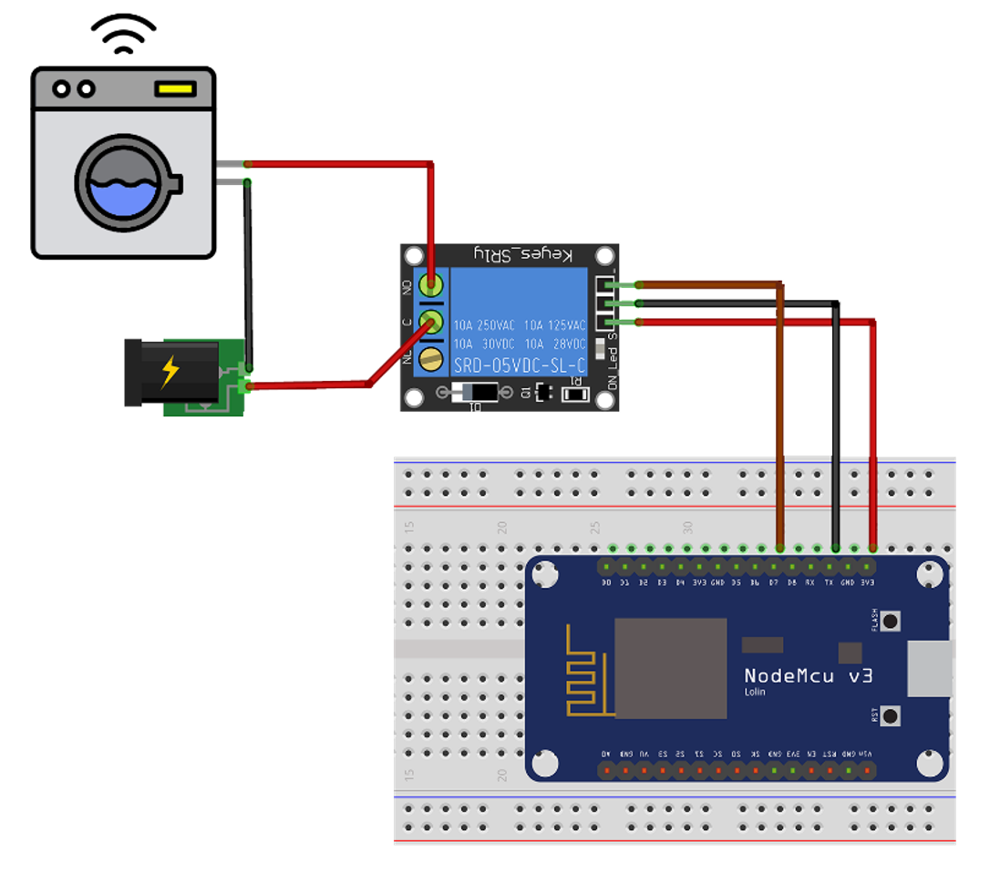

# Система автоматизированного управления стиральными машинами через Telegram-бот и ESP8266

### Описание проекта

Данный проект представляет собой систему автоматизированного управления стиральными машинами через Telegram-бот с использованием микроконтроллера ESP8266.  
Система предназначена для упрощения бронирования и оплаты услуг стирки, а также для дистанционного управления стиральными машинами.

### Основной функционал:

1. **Управление машинами через Telegram-бот**:
   - Включение и выключение машин с помощью команд бота.
   - Управление через ESP8266, выступающий в роли веб-сервера.
2. **Система бронирования**:
   - Выбор даты, времени и конкретной машины для стирки.
   - Генерация уникального ключа доступа к выбранной машине.
3. **Оплата услуг**:
   - Интеграция с платёжной системой ЮKassa.
   - Возможность замены на другие платёжные системы.

---

### Пример использования бота

1. **Запуск бота**:  
   Запустите бота и отправьте команду `/start`.  
   

2. **Получение inline-кнопок**:  
   После запуска бота вы получите набор кнопок для выбора действия.

3. **Бронирование машинки**:

   - Нажмите кнопку «Оплатить стирку».
   - Выберите день недели.
   - Укажите удобное время.
   - Выберите стиральную машину.  
     

4. **Оплата**:  
   После выбора стиральной машины бот предложит оплатить бронирование.  
   

5. **Получение уникального кода**:  
   После успешной оплаты пользователь получает уникальный код для доступа к машине.  
   

6. **Проверка кода**:  
   Для управления машиной пользователь должен предоставить уникальный код. Система проверяет его для обеспечения безопасности.  
   

7. **Управление машиной**:  
   Пользователь может включить или выключить машину через бот, используя полученный код.  
   

Итоговая блок-схема изображена.

---

### Схема подключения модуля оплаты

---

### Установка и настройка

1. **Создание Telegram-бота**:
   - Создайте бота через @BotFather.
   - Настройте ключи для работы с платёжной системой ЮKassa.
2. **Настройка ESP8266**:
   - Подключите ESP8266 к сети Wi-Fi.
   - Настройте HTTP-запросы для обработки команд управления `/OPEN_MACHINE` и `/CLOSE_MACHINE`.
3. **Запуск системы**:
   - Настройте функции управления в файле `machine_utils.py`.
   - Запустите бота и протестируйте систему.

---

### Используемые технологии

- Python
- Telegram Bot API
- ESP8266
- YooKassa (платежи)
- Arduino

---

---

# Automated Washing Machine Management System via Telegram Bot and ESP8266

### Project Description

This project is an automated washing machine management system controlled via a Telegram bot using the ESP8266 microcontroller.  
It simplifies the process of booking and paying for laundry services and allows users to remotely control washing machines.

### Main Features:

1. **Machine Control via Telegram Bot**:
   - Ability to turn machines on and off via bot commands.
   - Managed through ESP8266, functioning as a web server.
2. **Booking System**:
   - Users can select dates, times, and specific machines for laundry services.
   - Generates a unique access key for the selected machine.
3. **Service Payment**:
   - Integrated with the YooKassa payment system.
   - Flexibility to switch to other payment systems.

---

### Example of Bot Usage

1. **Starting the Bot**:  
   Launch the bot and send the `/start` command.  
   

2. **Receiving Inline Buttons**:  
   After starting the bot, you will receive a set of buttons to choose an action.

3. **Booking a Washing Machine**:

   - Click the "Pay for washing" button.
   - Select the day of the week.
   - Choose a convenient time.
   - Select the washing machine.  
     

4. **Payment**:  
   After selecting the washing machine, the bot will prompt you to pay for the booking.  
   

5. **Receiving a Unique Code**:  
   After successful payment, the user receives a unique code for accessing the machine.  
   

6. **Code Verification**:  
   To operate the machine, the user must provide a unique code. The system checks it for security purposes.  
   

7. **Operating the Machine**:  
   The user can turn the machine on or off via the bot using the unique code.  
   

The final flowchart is shown below.  

---

### Payment Module Connection Diagram

## 

### Installation and Setup

1. **Create a Telegram Bot**:
   - Use @BotFather to create a bot.
   - Set up keys for working with the YooKassa payment system.
2. **Configure ESP8266**:
   - Connect ESP8266 to a Wi-Fi network.
   - Set up HTTP requests to handle control commands `/OPEN_MACHINE` and `/CLOSE_MACHINE`.
3. **Run the System**:
   - Configure management functions in the `machine_utils.py` file.
   - Launch the bot and test the system.

---

### Technologies Used

- Python
- Telegram Bot API
- ESP8266
- YooKassa (payments)
- Arduino

---
